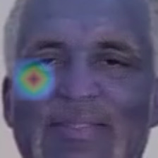
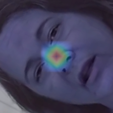

## Example Images: Real vs. Fake

### Fake Image Example
#### 1. `11_FAKE_138.png`

#### 2. `11_FAKE_77.png`

- These images above are labeled as **FAKE**.  
- Typically images correctly labeled as FAKE tend to have detections around facial features such as the eyes, the nose and the mouth.
- The size of the detections tens to be smaller the mode confident the model is in its predictions.

---

### Real Image Examples

#### 1. `11_REAL_263.png`

#### 2. `11_REAL_282.png`

- These images above are labeled as **REAL**.  
- Images correctly labeled as REAL tend to have no activations in the face, instead they have activations outside of it. 

---

## Disclaimer
- These images were selected from the dataset for illustration and analysis purposes.
- Not all correctly classified REAL and FAKE images show the trends highlighted above.
